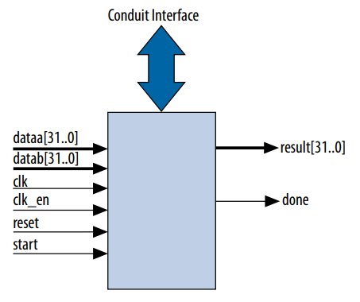
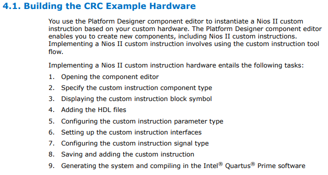

# Labo04

## Leds

Ajout des Leds de ``pins_all.tcl`` dans ``pins.tcl``


## Conversion RGB -> grayscale

1) Red : 5 bits
2) Green : 6 bits
3) Blue : 5 bits

$$\text{red}\longrightarrow \text{red}*30/100$$
$$\text{green}\longrightarrow \text{green}*59/100$$
$$\text{blue}\longrightarrow \text{blue}*11/100$$

1) Red : 10 bits
2) Green :  12 bits
3) Blue : 9 bits

Total : 13 bits

Total / 100 : 6 bits

### Optimisation

Avec le script python on trouve :

```C
gray =  (
        (rgb>>RED_SHIFT)*338 +
        ((rgb>>GREEN_SHIFT)&0x3F)*573 +
        (rgb&0x1F)*113
        )>>10
```

Pour activer le cache, on clic droit sur Nios, puis memory/cache et on mets 32kbyte de mémoire pour data


### 01.12.2021 : Ajout de fonctions custom


  

